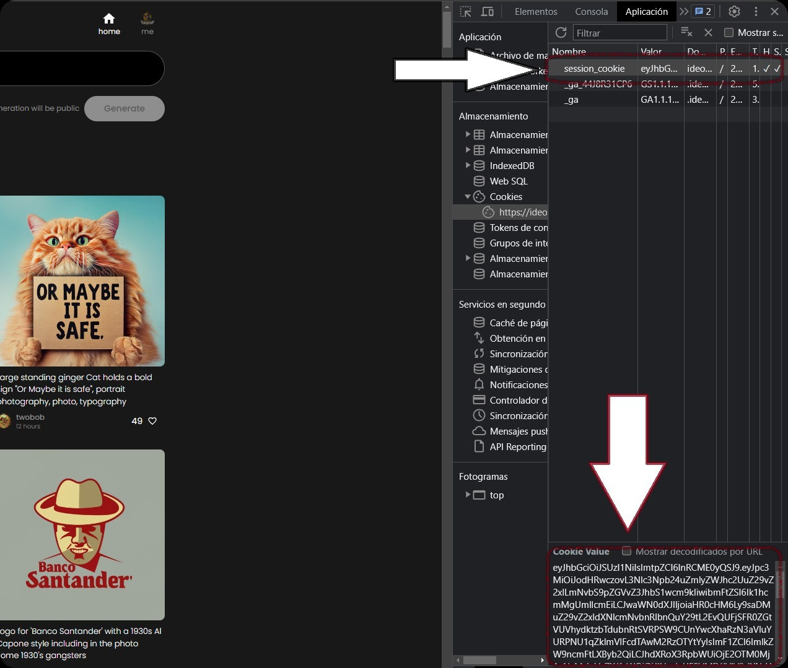

# Ideogram Wrapper


Written by @Flowese


## Description


`ideogram_wrapper` is a Python package that allows you to generate images from Ideogram's API using textual prompts. This package is based on reverse engineering of Ideogram's API and is not officially endorsed by Ideogram.

## Advantages Over Other Models

Unlike other generative models like DALL-E 2 or MidJourney, Ideogram has the unique advantage of generating images that faithfully respect the text prompts you provide. This makes it a superior choice when you need accurate correlation between the input text and the generated image.

## Legal Disclaimer

This package is created for educational and research purposes. By using this package, you agree to do so at your own risk. This package is not affiliated, endorsed, or sponsored by Ideogram in any way.

## Requirements

- Python 3.x
- pip

## Installation

### From PyPI

To install the package from PyPI, run the following command:

```bash
pip install ideogram_wrapper
```

### From GitHub Repository

To install the package directly from the GitHub repository, run:

```bash
pip install git+https://github.com/flowese/IdeogramWrapper.git
```

## Configuration

### Obtaining the Session Token

1. Sign up at [Ideogram](https://ideogram.ai/signup).
2. Once registered, open your browser's inspector:
   - In Chrome: `Ctrl+Shift+I` or `F12` on Windows, `Cmd+Option+I` on Mac.
3. Go to the `Application` tab.
4. On the left panel, locate and click on `Cookies`, then select the Ideogram website.
5. Find the cookie named `session_cookie`.
6. Click on `session_cookie` and copy the value in the `Value` field.



### Usage

To use `ideogram_wrapper`, import the `IdeogramWrapper` class and provide the necessary parameters.

```python
from ideogram_wrapper import IdeogramWrapper

ideogram = IdeogramWrapper(
    session_cookie_token="your_token_here",  # The value you copied from the session cookie
    prompt="a picture of a dog with a sign saying 'Hello World'",
    aspect_ratio="landscape",  # Can be "landscape", "portrait", or "square"
    enable_logging=True
)
ideogram.inference()
```

#### Parameters

- `session_cookie_token`: (Required) The session token you obtained from the cookie.
- `prompt`: (Required) The textual prompt for generating the image.
- `aspect_ratio`: (Optional) The aspect ratio of the image. Can be "landscape", "portrait", or "square". Default is "square".
- `enable_logging`: (Optional) Whether to enable logging. Default is `False`.

## License

This project is licensed under the MIT License.

## Contributing

If you'd like to contribute to this project, feel free to fork the repository and send a pull request, or open an issue to discuss what you'd like to change. All contributions are welcome!
